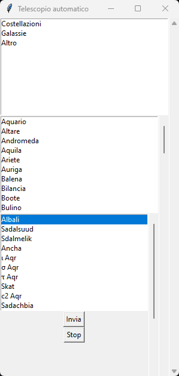

# Automatic Telescope (ITA)
Automation for Bresser skylux 70/700 ng

## Getting started
This project is designed for the Bresser skylux ng telescope, but the program could also work for other automatic DIY telescopes by modifying some parameters within the Arduino program.

This project is made up of 3 parts:
* Graphical interface to select astronomical bodies (Python program)
* Motion control program (Arduino program)
* Hardware

### GUI
The python program is responsible for choosing the astr. object and requesting the coordinates of the astr. body from the Stellarium API.



## Interested in programming?
This program is complitely written in Python3.
These are the libraries required to run the program:

* ast
* requests
* tkinter
* serial
* time
* importlib
* ctypes
* importlib

So if, perhaps, you dont have one of this library already installed, just open CMD and write:
```
pip install library_name
```
Replacing "library_name" with the actual library name you find up.
