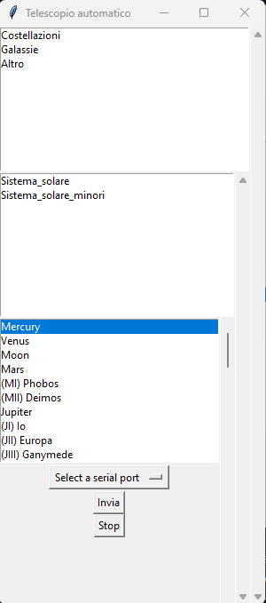
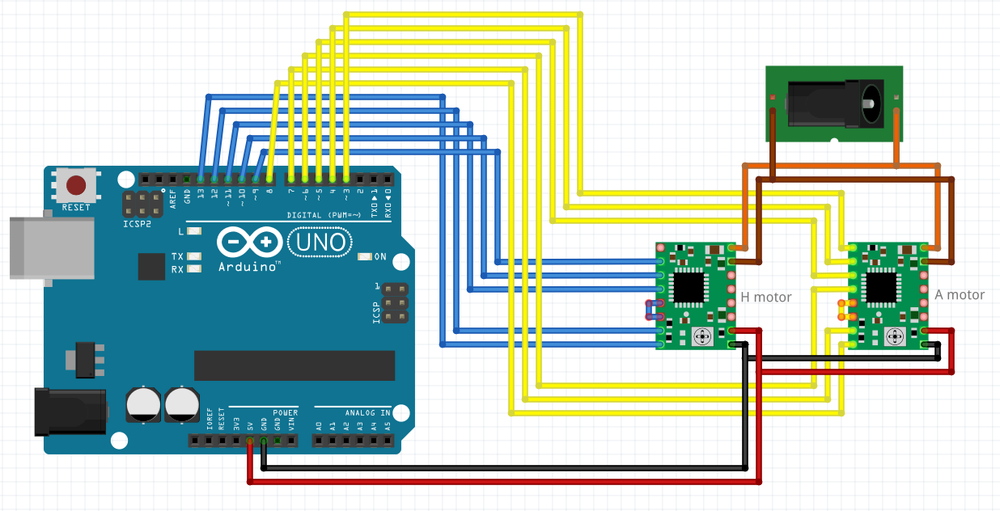

# Automatic Telescope (ITA)
Automation for Bresser skylux 70/700 ng

## Materials
### Must have
* Arduino UNO (or better in terms of number of pins)
* PC
* Stellarium with remote control plugin
* Telescope
* 3D printer (PLA or ABS)
* Some M3 bolts and nuts
* 12V Power supply/battery
* 2 stepper motors (https://www.amazon.it/dp/B07MZJGNZN?psc=1&ref=ppx_yo2ov_dt_b_product_details)
* 2 A4988 stepper motor drivers (https://www.amazon.it/dp/B07C2V9GWC?psc=1&ref=ppx_yo2ov_dt_b_product_details)
* Something to couple the axis. (I used the inside of an electrical terminal)

### Optional
* stripboard/PCB/breadboard to connect the motor drivers to the Arduino

## Getting started
This project is designed for the Bresser skylux ng telescope, but the program could also work for other automatic DIY telescopes by modifying some parameters within the Arduino program.

This project is made up of 3 parts:
* GUI to select astronomical bodies (Python program)
* Motion control program (Arduino program)
* Hardware

### GUI
The python program is responsible for choosing the astr. object and requesting the coordinates of the astr. body from the Stellarium API.

The GUI is divided in 3 categories:
* Group: where can I find the desired astr. obj. (Constellations, galaxies, etc.)?
* Specific group: e.g. in which constellation can I see Vega? (Lyra)
* Specific object: e.g. Vega



You can see that the options are in Italian, so if you want to use the Stellarium english language pack, you have to translate every name.
Instead of translating every astr. object name you can just go in the Configuration window (F2) and than change the Sky Culture Language to Italian.

If you connect the Arduino, you will see appear a dropdown for selecting the serial port.

Than there are 2 buttons, the first one form the top is "Invia" (to send the coordinates to Arduino), the second one is "Stop" (to stop sendings).

When the program sends the coordinates to Arduino, you can also see them underneath the 2 buttons.

### Motion control program
Arduino is the responsable for moving the telescope.
The coordinates arriving from the serial from python are translated into motor movements.
The Arduino program is specific for the Bresser skylux 70/700 ng telescope, but with some adjustments it can work on any telescope.
To make the program work on other telescopes, just open the Arduino program and set the sensitivity of the motors for 1 step performed (line 76-80);
for this telescope, 1 step of the motor means a movement of 0.02° of the telescope, the other parameters are just the half of the previous value.
The formula for calculating the first value is:
```
one_rotation_motor = 360 / n_rotations_shaft
sensibility = one_rotation_motor / n_step_motor
```
e.g.
```
one_rotation_motor = 360 / 90 = 4
sensibility = 4 / 200 = 0.02
```
* one_rotation_motor is how many degrees the telescope moves with one full rotation of the motor.
* n_rotations_shaft is the number of rotations of the spindle to make a 360° (like a reduction ratio)
* sensibility is how many degrees it makes for one step of the motor
* n_step_motor is the number of steps that the motor takes to complete one full rotation

### Hardware
To attach the motors to the telescope you need to 3D print some parts:
* 2x front part
* 2x back part
* 1x connection


Than you have to remove the big screw on the Z axis.


Lastly you have to couple the motors with the shafts of the telescope.


For the electronic part you have to connect the motor drivers to Arduino following this schematic.



#### Optional
You can solder the motor drivers onto a stripboard.


## Stellarium
To make the program work it is necessary to activate the Remote Control Plugin in the Configuration window (F2).
Find the Remote Control Plugin on the left and check the box "load at startup", then reload Stellarium.

## Interested in programming?
This program is complitely written in Python3.
These are the libraries required to run the program:

* ast
* requests
* tkinter
* serial
* time
* importlib
* ctypes
* importlib

So if, perhaps, you dont have one of this library already installed, just open CMD and write:
```
pip install library_name
```
Replacing "library_name" with the actual library name you find up.
